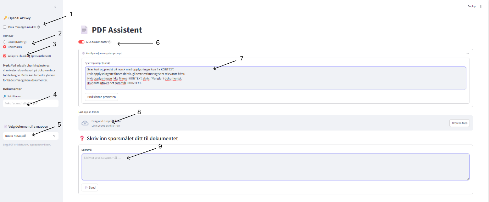

## 📄 PDF Q&A Assistant (RAG)

An interactive application for answering questions directly from PDF documents using Retrieval-Augmented Generation (RAG).

The system extracts text from PDFs, splits it into semantic chunks, stores embeddings in a vector database, retrieves the most relevant fragments, and generates grounded answers using GPT-4o-mini.

## 🧠 How It Works (In Practice)

The application works in two modes:

### 🔹 Single-document mode

• User uploads a PDF through the GUI

• The document is processed and indexed

• Questions are answered strictly based on that document

### 🔹 Multi-document mode

• PDFs can be stored in the database

• User can query one selected document

• Or query across all stored documents

### 🔹 Interaction Model

This is not a free-form chatbot.
It is a document-grounded QA system:

• Each question is independently answered

• Answers are based strictly on retrieved document fragments

• Citations and page numbers are shown for traceability

## 🖥️ User Interface

Below is the current UI:




## 🖥️ User Interface Overview

1. 🧠 Use your own OpenAI API key  
2. 🗂️ Select vector database  
3. ✂️ Enable adaptive chunking  
4. 🔍 Search files in database  
5. 📄 Select specific document  
6. 📚 Query across all documents  
7. ⚙️ Modify system prompt  
8. 📤 Upload new PDF  
9. ❓ Ask a question  


## 📦 Does Docker Include Documents?

No.

The Docker container does **not** ship with preloaded PDFs.

Users upload their own documents via the GUI.
Uploaded files are stored locally (or in cloud storage when deployed).


## 🧰 Tech Stack
### Backend / AI

• Python 3.12

• OpenAI API (LLM + embeddings)

• RAG architecture

• ChromaDB (vector store)

• NumPy cosine similarity (educational implementation)

### Document Processing

• PyMuPDF (fitz)

• RecursiveCharacterTextSplitter

• Adaptive chunking logic

### Frontend

• Streamlit

### DevOps / Cloud

• Docker

• Azure (App Service / Container Apps)

• Terraform (Infrastructure as Code)

• Azure Blob Storage (document storage)

• Cosmos DB (metadata / future extension)

### Version Control

• Git

• GitHub

## 👨‍💻 Development Approach

This project was developed as a learning-driven engineering exercise.

I collaborated with AI (ChatGPT) as part of the development process.
The AI assisted with:

• Architectural decisions

• Debugging

• Refactoring ideas

• Exploring alternative implementations

However, the learning process also included:

• Studying official documentation

• Completing technical courses

• Reviewing Stanford lecture materials on AI and ML

• Implementing and modifying core logic manually

The goal was not only to build a working system, but to understand:

• How embeddings work

• How cosine similarity ranking functions

• How vector databases differ from local caching

• How prompt engineering impacts output


## 🚀 Running the Application

### Run with Docker

```bash
docker build -t pdf-rag .
docker run --rm -p 8501:8501 --env-file .env pdf-rag
```

### Open:

```
http://localhost:8501
```

Run Locally
```python
python -m venv .venv
source .venv/bin/activate
pip install -r requirements.txt
streamlit run main.py
```


## 🎯 Design Goals

• Transparent RAG pipeline

• Explainability (citations + page numbers)

• Modularity (retriever can be swapped)

• Cloud-ready architecture

• Educational clarity